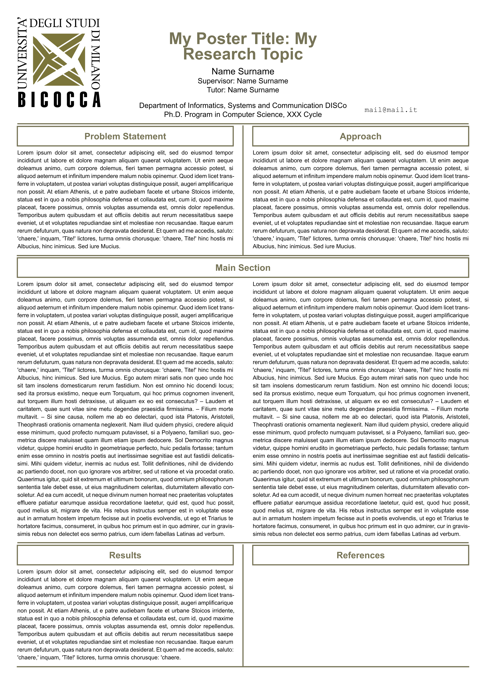
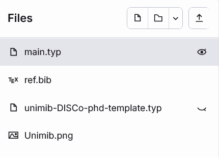
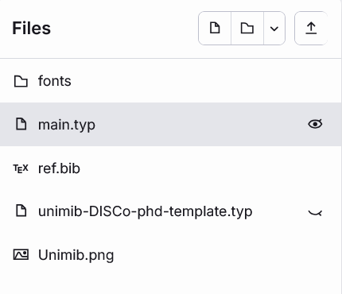

# unimib-poster-template
A template for PhD Day posters at the University of Milano-Bicocca, Department of Informatics, Systems and Communication (DISCo).


## Quick Start
1. Go to [typst.app](https://typst.app) (or download the compiler locally), create a new project, and copy-paste the content of `template/` in the root directory.





> [!NOTE]
> **main.typ** — Typst will ask you if you want to overwrite the main.typ file that was automatically generated. In this case you do.

2. Edit the `main.typ` file and substitute `#lorem()` with your text.

```typst
#show: main-heading.with(
  title: "My Poster Title: My Research Topic",
  author: "Name Surname",
  supervisor: "Name Surname",
  tutor: "Name Surname",
  email: "mail@mail.it",
  phdcycle: "XXX",
  logo-left: "Unimib.png",
  logo-right: none
)


#let problem-statement = [
  #lorem(150)
]
#let approach = [
  #lorem(150)
]
#let main-left = [
  #lorem(400)
]
#let main-right= [
  #lorem(400)
]
#let results = [
  #lorem(140)
]
```

### Research Group Logo
Just upload the `.png` to the project root and reference it inside `main.typ`.

```typst
...
  logo-right: "mylogo.png"
...
```

### Bibliography
If you add some references to the `ref.bib` file, they will automatically be included in the correct section (if cited with @).


### Fonts
If you want the official fonts for the poster ("Arial" and "Courier New"), you need to create a `/fonts` folder and upload the .ttf files. The template will automatically use them when available.



## Disclaimer
The University of Milano-Bicocca logo is the property of the University of Milano-Bicocca. All font names mentioned (Arial, Courier New) are trademarks of their respective owners. This template is not affiliated with or endorsed by any of the respective trademark holders.
